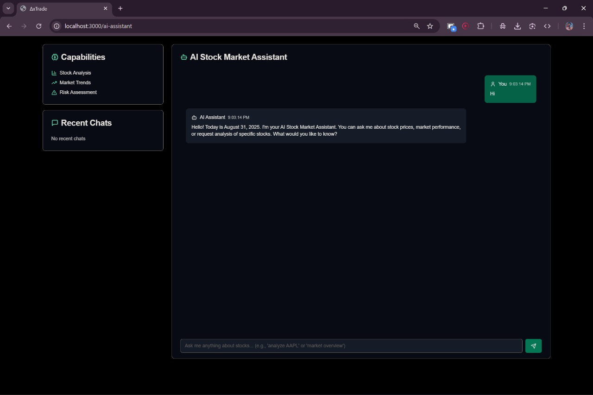
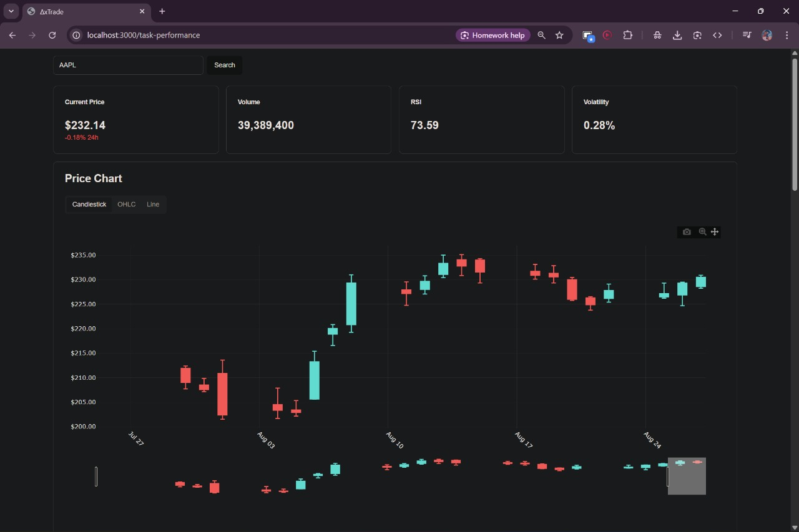
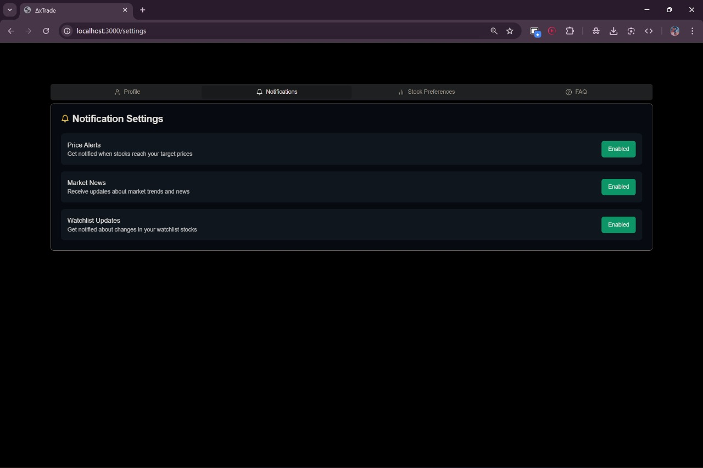
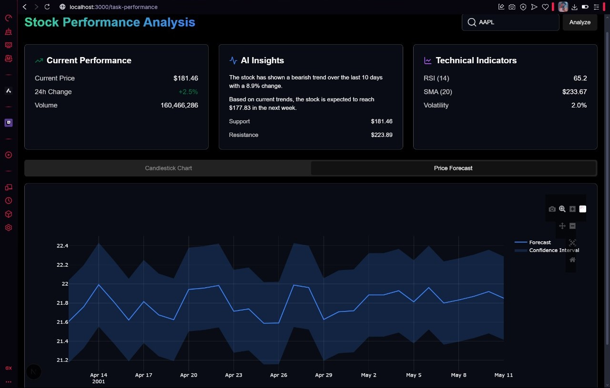

# TradeX 📈

> **A modern, AI-powered stock trading and analysis platform built with Next.js**

TradeX is a comprehensive stock trading platform that combines real-time market data, advanced charting, and AI-driven insights to provide traders and investors with powerful tools for market analysis and decision-making.

## ✨ Key Features

### Core Trading Features
- **Real-Time Market Data** - Live stock prices and market updates
- **Interactive Candlestick Charts** - Professional-grade charting with zoom and pan
- **Multiple Timeframes** - 1D, 1W, 1M, 3M, 1Y analysis periods
- **Technical Indicators** - RSI, MACD, Moving Averages, and more
- **Watchlist Management** - Track your favorite stocks with real-time updates

### 🤖 AI-Powered Intelligence
- **Natural Language Queries** - Ask questions like "Analyze AAPL stock"
- **Market Insights** - AI-generated analysis and trading recommendations
- **Stock Forecasting** - Predictive analytics for price movements
- **Personalized Recommendations** - Tailored stock suggestions

### 🎨 Modern User Experience
- **Dark Theme Interface** - Sleek, professional trading environment
- **Responsive Design** - Works perfectly on desktop and mobile
- **Smooth Animations** - Polished interactions with Framer Motion
- **Real-Time Updates** - Live data refresh without page reloads

## 🛠️ Technology Stack

| Category | Technologies |
|----------|-------------|
| **Frontend** | Next.js 15.2.4, TypeScript, Tailwind CSS |
| **UI Components** | Radix UI, shadcn/ui, Lucide React |
| **Charts** | Lightweight Charts (TradingView) |
| **Animations** | Framer Motion |
| **Backend** | Node.js, Express.js |
| **APIs** | Yahoo Finance, Alpha Vantage, Google Gemini AI |
| **Data** | CSV files, Real-time API integration |

## 📸 Screenshots


*Main trading dashboard with market overview, real-time data, and stock explorer*


*Intelligent AI-powered assistant for stock analysis and market insights*


*Detailed stock performance charts with technical indicators and analysis*


*Personalized watchlist with favorite stocks and real-time tracking*


*User settings, notifications, and platform customization options*


*Full application interface showing all features and components*

## 🚀 Quick Start

### Prerequisites
- **Node.js** 18.0.0 or higher
- **npm** or **pnpm** package manager
- **Google Gemini API Key** ([Get one here](https://ai.google.dev/))
- **Alpha Vantage API Key** (Optional - [Get one here](https://www.alphavantage.co/))

### Installation

```bash
# 1. Clone the repository
git clone https://github.com/codexcherry/TradeX.git
cd TradeX

# 2. Install all dependencies (frontend + backend)
npm run install-deps

# 3. Set up environment variables
cp Dashboard/env.example Dashboard/.env.local
```

### Environment Configuration

Edit `Dashboard/.env.local`:

```env
# Required: Google Gemini AI API Key
NEXT_PUBLIC_GEMINI_API_KEY=your_gemini_api_key_here

# Optional: Alpha Vantage for enhanced forecasting
ALPHA_VANTAGE_API_KEY=your_alpha_vantage_key_here

# Optional: Custom backend URL (defaults to localhost:3001)
NEXT_PUBLIC_BACKEND_URL=http://localhost:3001
```

### Development

```bash
# Start both frontend and backend servers
npm run dev

# Or start individually:
npm run dev:frontend  # Frontend only (localhost:3000)
npm run dev:backend   # Backend only (localhost:3001)
```

**🎉 Open [http://localhost:3000](http://localhost:3000) to see TradeX in action!**

## 📁 Project Structure

```
TradeX/
├── 📄 README.md                    # Main documentation
├── 📄 PROJECT_STRUCTURE.md         # Detailed architecture guide
├── 📄 package.json                 # Root package with scripts
├── 🖥️  server.js                   # Express backend server
├── 📊 StockData/                   # CSV stock data files
│   ├── stock_data.csv
│   └── market_data.csv
├── 🖼️  Assets/                     # Project screenshots and media
│   ├── Demo.jpg                    # Live demo screenshot
│   ├── 1.jpg                       # Complete application overview
│   ├── dashboard.jpg               # Main dashboard interface
│   ├── ai-assistance.jpg           # AI assistant interface
│   ├── taskperformance.jpg         # Performance analysis charts
│   ├── watchlist.jpg               # Watchlist management
│   └── settings.jpg                # Settings and preferences
└── 🎨 Dashboard/                   # Next.js frontend
    ├── 📱 app/                     # App Router (Next.js 13+)
    │   ├── page.tsx                # Home page
    │   ├── layout.tsx              # Root layout
    │   ├── globals.css             # Global styles
    │   └── api/                    # API routes
    ├── 🧩 components/              # React components
    │   ├── ui/                     # shadcn/ui components
    │   ├── charts/                 # Chart components
    │   ├── ai/                     # AI assistant components
    │   └── watchlist/              # Watchlist components
    ├── 🔧 lib/                     # Utilities
    │   ├── utils.ts                # Helper functions
    │   ├── api.ts                  # API configurations
    │   └── types.ts                # TypeScript types
    ├── 🌐 public/                  # Static assets
    └── ⚙️  next.config.js           # Next.js configuration
```

##  API Integration

### Stock Data Sources

| API | Purpose | Cost | Rate Limit |
|-----|---------|------|------------|
| **Yahoo Finance** | Real-time prices, charts | Free | Unlimited |
| **Alpha Vantage** | Forecasting, indicators | Free tier | 25 calls/day |
| **Google Gemini** | AI analysis | Free tier | 60 requests/minute |

### Available Endpoints

```javascript
// Backend API endpoints (localhost:3001)
GET  /api/stocks              // All available stocks
GET  /api/stocks/:symbol      // Single stock data
GET  /api/stocks/:symbol/forecast  // Stock price forecast
POST /api/ai/analyze          // AI stock analysis
```

## Usage Examples

### Adding Stocks to Watchlist
```javascript
// Click the "+" button next to any stock
// Or use the search functionality to find and add stocks
```

### AI Assistant Queries
```
"Analyze Apple stock performance"
"What's the market trend for tech stocks?"
"Should I buy Tesla stock now?"
"Compare AAPL vs GOOGL"
```

### Chart Interactions
- **Zoom**: Mouse wheel or pinch gesture
- **Pan**: Click and drag
- **Timeframe**: Click 1D, 1W, 1M, 3M, 1Y buttons
- **Indicators**: Toggle RSI, MACD from chart controls

## ⚡ Performance Optimizations

- **Code Splitting**: Automatic route-based splitting
- **Image Optimization**: Next.js automatic image optimization
- **API Caching**: Intelligent caching for stock data
- **Lazy Loading**: Components loaded on demand
- **Memoization**: React.memo for heavy components

## 🔒 Security & Privacy

- **API Key Protection**: Environment variables for sensitive data
- **CORS Configuration**: Secure cross-origin requests
- **Input Validation**: Sanitized user inputs
- **Rate Limiting**: API request throttling
- **No Personal Data**: No user data stored locally

## Acknowledgments

- **TradingView** for Lightweight Charts library
- **Yahoo Finance** for free stock data API
- **Google** for Gemini AI integration
- **Alpha Vantage** for market data and forecasting APIs
- **Vercel** for Next.js framework and deployment platform
- **shadcn** for beautiful UI components
- **Radix UI** for accessible component primitives
- **Tailwind CSS** for utility-first styling framework

## Developed by

**codexcherry © 2025**
